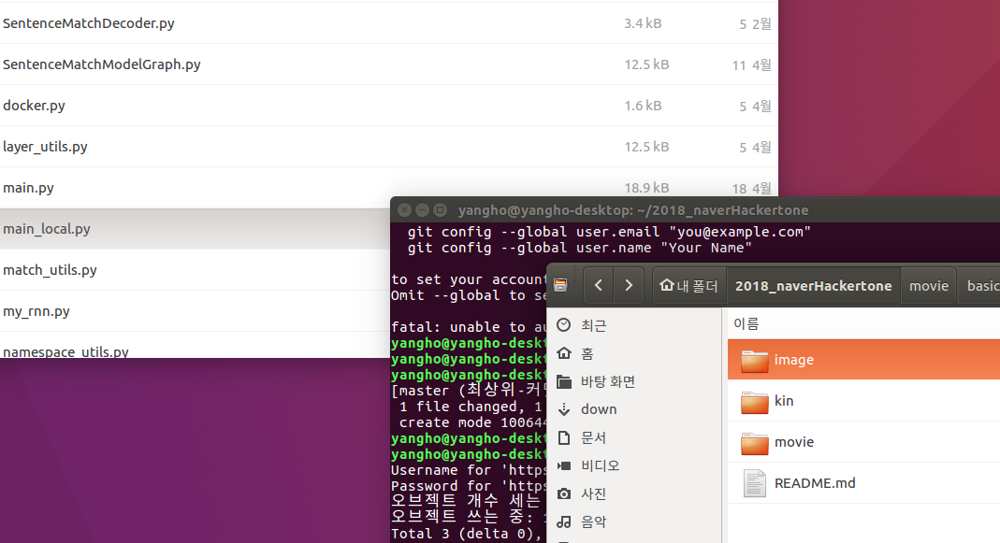

# 2018_naver_hackertone

-------------------------------------
# 목적

 2018 naver 해커톤을 참여하면서 마주치게된 여러 문제들이 있습니다. 대부분의 문제들은 nsml을 사용하는 도중 생긴 문제들입니다. 그래서 추후 대회나 혹은 nsml의 사용자들 역시 겪을 문제점이라 생각하고 제가 겪은 문제들과 해결방법들을 공유하기위해서 이 글을 쓰게 되었습니다. 더 나아가서 제가 대회에 참가하면서 작성한 코드역시 공유하여 다음 대회에 많은 경험이 공유 되길 바랍니다.

