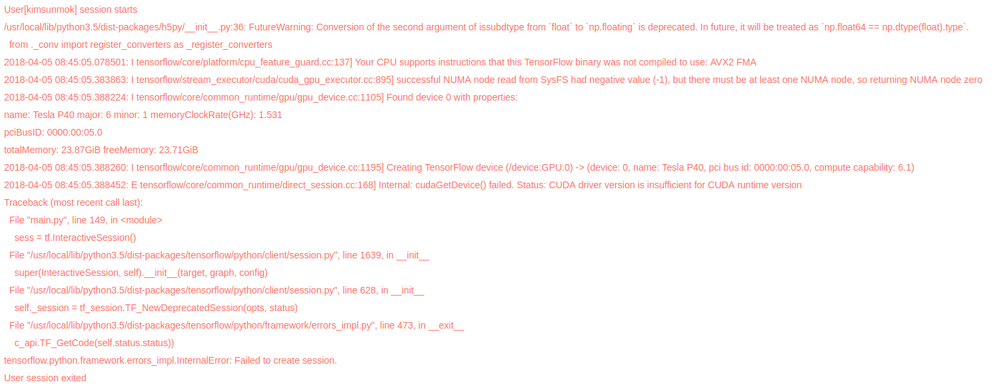
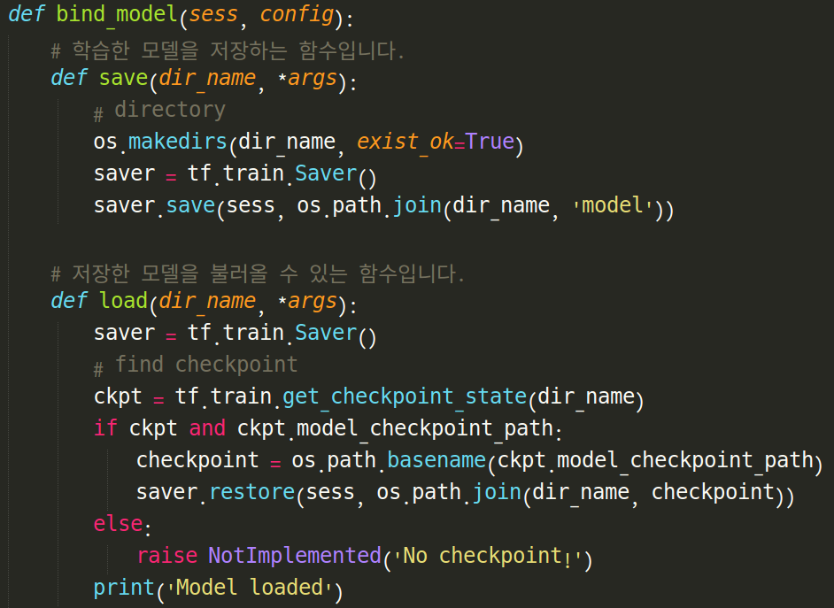
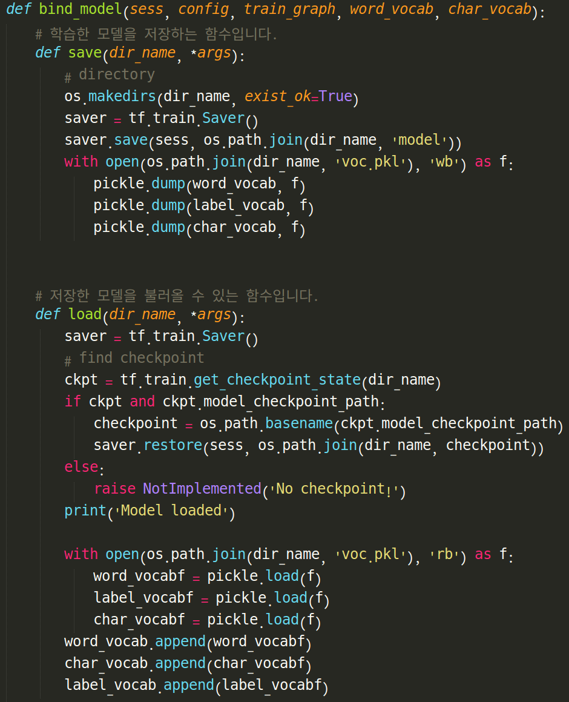
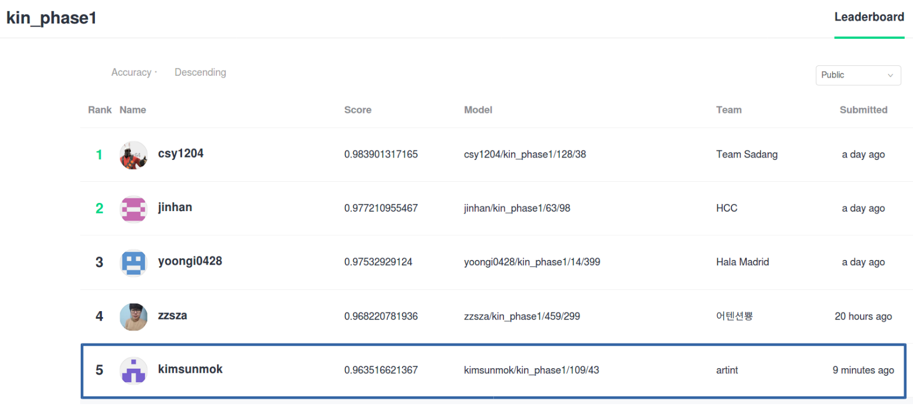
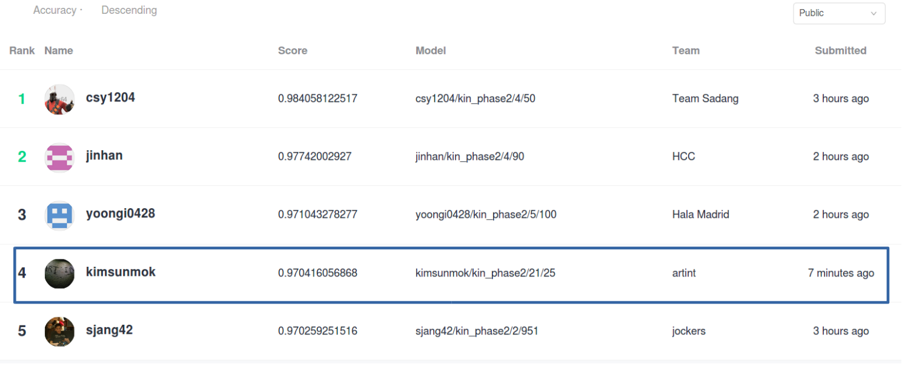
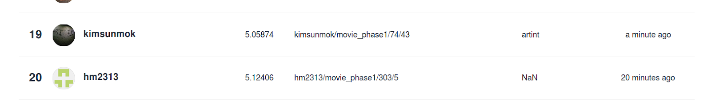

# 2018_naver_hackathon

# 목적

2018 naver 해커톤을 참여하면서 마주치게된 여러 문제들이 있습니다. 대부분의 문제들은 nsml을 사용하는 도중 생긴 문제들입니다. 그래서 추후 대회나 혹은 nsml의 사용자들 역시 겪을 문제점이라 생각하고 제가 겪은 문제들과 해결방법들을 공유하기위해서 이 글을 쓰게 되었습니다. 더 나아가서 제가 대회에 참가하면서 작성한 코드역시 공유하여 다음 대회에 많은 경험이 공유 되길 바랍니다.

# 1차 예선 (4월2일 ~9일)
 1차 예선에서는 nsml에 적응 하는 것에 대부분의 시간을 투자하였다. 대표적인 문제점들은 첫번째 원하는 tensorflow 버전을 사용하기 위한 도커 문제, 두번째로 word embbeding을 저장하기위한 nsml save함수 사용법 문제, 마지막으로 submit을 하기 위해서 코드의 전체적인 구성을 맞춰주는 문제이다.
 질문 유사도 문제를 예를 들어서 진행 과정을 서술한다.
 
- 질문 유사도 문제

Requirements:

 * Python 3
 * tensorflow > 0.12
 * Numpy
동작 환경 : python3.5 이상, tensorflow 1.5 이상

질문 유사도 문제를 풀기 위해서 사용한 알고리즘은 [BiMPM](https://arxiv.org/pdf/1702.03814.pdf) 이란 알고리즘으로 이 [github](https://github.com/zhiguowang/BiMPM)의 코드를 기본으로 해서 코드를 수정하여 만들었다. 

  본래 bimpm 코드에서는 word embbeding을 위한 word vector를 사전학습을 먼저 시킨 후 txt파일로 폴더내에 저장해 놓는다. 그리고 main 코드에서 모델을 빌드할 때 이 txt파일을 불러와서 사용하게 된다. 하지만 nsml에서는 코드가 로컬 컴퓨터에서 실행 되는것이 아니라 nsml 서버에서 실행이 된다. 이때
.py file만 서버로 가져가기 때문에 txt파일을 사용 할 수 없게된다. 그래서 필자는 코드가 nsml서버로 보내진 뒤 학습 데이터를 전처리 할때 word
embbeding을 빌드하도록 코드를 수정 하였다. /kin/BiMPM/main_local.py 의 268 ~ 279 line의 코드가 이 과정을 수행한다.
(결선에서 알게 된 사실이지만 도커를 이용해서 사전학습된 txt파일을 이용 할 수 있다. 이는 추후에 설명한다.)

1. docker 문제

먼저 도커에 대해 간략히 설명하자면 nsml 서버는 도커 이미지를 사용해서 환경을 구성한다. 이는 자신에게 알맞은 도커 이미지만 찾을 수 있으면 환경구성에 시간을 쓸 필요가 없다는 큰 장점이 있다. 예를 들자면 자신의 코드가 python3, tensorflow r1.5, cuda8, cudnn6에서 동작한다면 이에 맞는 도커 이미지를 도크허브에서 찾아서 사용하면 된다. 기본적인 사용법은 폴더내의 setup.py 파일의 맨 윗 부분에 자신이 사용할 도커 이미지의 tag를 밑 과 같이 입력하면 된다.

    #nsml: floydhub/tensorflow:1.5.0-gpu.cuda8cudnn6-py3_aws.22

 docker 사용 문제는 로컬에서 debug용 학습데이터를 이용해서 코드를 실행했을때 문제 없이 돌아가서 nsml서버를 통해서 학습시키고자 했을때 나타났다. 문제의 원인은 nsml에서 기본으로 제공하는 도커의 경우 tensorflow 1.4 버전이다. 그러나 본 코드의 경우 1.5이상 버전에서만 동작을 하기 때문에 문제가 발생하였다. 이에 대해서 질문한 결과 [도크허브 링크](https://hub.docker.com/r/tensorflow/tensorflow/tags/)를 추천 받았다. 이 곳은 tensorflow 모든 버전들이 도커로 제공되어 있는 곳이다. 하지만 문제가 있다. 좀 이해가 안되지만 tensorflow 도커지만 cuda가 포함되어 있지 않다는 것이다. 그래서 그냥 사용하게 되면 밑과 같은 error를 볼 수 있다. 

 
즉, 위에 있는 링크의 도커들은 사용 할 수 없다. 저 도커를 활용해서 새로운 도커 이미지를 만든다면 사용 할 수 있겠지만 당시 필자는 도커 이미지 만드는 방법을 몰랐기 때문에 도크허브 검색을 통해서 맞는 도커를 찾는데 집중하였다. 조건에 맞는 대부분의 도커를 사용해봤고 동작하는 도커 하나를 겨우 찾을 수 있었다. floydhub/tensorflow:1.5.0-gpu.cuda8cudnn6-py3_aws.22 이 도커는 tensorflow 1.5 gpu를 지원 한다. 단점은 nsml에서 기본 제공하는 도커에 비하면 굉장히 드리다는 것이다. session을 여는데 약 3분 정도가 소요된다.

2.  word embbeding을 저장하기위한 nsml save함수 사용법 문제
 
학습과 submit은 독립적으로 이루어 진다. 즉, 학습을 할때 nsml.save() 함수를 통해 모델을 중간 중간 저장하고 submit때는 이 것을 불러온 후 submit을 진행 하게 된다. 바로 이 부분에서 문제가 발생하게 되는데 nsml.save() 함수의 내용은 밑과 같은데, 

보면 tensorflow의 Saver 함수를 사용해서 모델을 저장한다. 그런데 이 Saver 함수는 모델 그래프와 tensor들만 저장 하기 때문에 word embbeding에 필요한 word vocablary, char vocablary는 사전 형태로 되어있기 때문에 저장이 안된다. 이렇게 되면 submit 과정을 수행 할 때 모델은 로드를 해도 vocablary는 날아가 있기 때문에 테스트 데이터를 벡터로 변환 할 수 없게 되어서 error가 난다. 이를 해결하기 위해서는 사전형태의 vocablary를 따로 저장 할 필요성이 있다. 필자는 vocablary를 pickel file로 만들어서 nsml.save()때 저장하는 방법을 사용하였다. 수정된 코드는 밑과 같다. 

여기서 중요한 점은 bind_model의 인자로 vocablary들을 추가 해주어야 한다는 점과 ckpt 파일이 저장되는 곳과 동일한 장소에 pickle 파일을 저장해야 한다는 것이다. 이렇게 코드를 수정 함으로써 submit이 실행 됐을때 load 함수에서 pickle 파일을 불러오게 되고 학습때와 동일한 vocablary를 얻을 수 있게 된다.

### 1차 예선 결과 

- 질문 유사도 :  submit을 한 결과 꾀 높은 성공률을 볼 수 있었다. 이를 기반으로 약간의 파라미터 튜닝 과정을 거쳐서 최종적으로 예선 1차를 5위로 마무리 할 수 있었다. phase1/kin/main.py file이 실제 제출한 코드이고, main_local.py는 nsml을 사용하지 않고 로컬에서 테스트 해볼 수 있는 코드이다. 
- 영화 평점 : 시간이 부족하여 1차예선에서는 네이버에서 제공한 코드를 파리미터 튜닝하여 사용하였다. 50위권에 랭크 되었다.
 
 

* * *

# 2차 예선 (4월10일 ~16일)

 2차 예선에서는 영화 평점 알고리즘 개발에 집중 하였다. 유사도 문제의 경우 1차 예선에 썼던 알고리즘을 그대로 쓰고 적절한 파라미터를 찾는 작업을 하였다. 영화 평점 알고리즘의 경우 [Convolutional Neural Networks for Sentence Classification (EMNLP 2014)](https://arxiv.org/abs/1408.5882)을 사용하였다. 이 알고리즘을 기초로 해서 2가지 변형을 추가하여서 총 3가지의 모델을 만들어서 2차 예선에 제출 하였다. 이를 차례대로 소개 한다.
 
 
 Requirements
 
 * Python 3
 * tensorflow > 0.12
 * Numpy
 * nsml
 
 
1. basic text CNN (./phase2/movie/basic_CNN_baseline/)
  
  모델의 구성을 논문에 나온 그대로 하고 데이터를 전처리 하는 부분(data_helpers_nsml.py)과 제출하기 위해 출력 포멧(main.py)을 맞추는 부분을 수정하였다. 그리고 main code의 경우 nsml에서 사용이 가능하도록 구성을 수정 하였다. 코드는 이 [github](https://github.com/dennybritz/cnn-text-classification-tf)의 내용을 사용하여 작성하였다. 

2. LSTM CNN (./phase2/movie/LSTMCNN/)

  1번의 모델 성능이 뛰어나지 않았기 때문에 다른 여러 모델을 고려하던중 LSTM을 사용하여 특징 벡터를 추출하고 이 벡터를 다시 CNN을 사용하여 영화 평점을 예측하는 모델을 찾아서 이를 사용해 보았다. 이 모델은 이 [github](https://github.com/pmsosa/CS291K)의 코드를 수정하여 사용하였다.
  이 폴더내의 main_debug.py의 경우 nsml의 설치 없이도 실행이 가능하다. 
  
3. LSTM CNN classify(./phase2/movie/LSTMCNN_class/)

  1, 2번 모델의 경우 모델의 최종 값이 0 ~ 1사이의 값을 갖고 여기에 x10을 해서 최종 예측 점수로 사용한다. 뛰어난 결과를 얻지 못했기 때문에 여러가지를 시도 하던중 0 ~ 1값을 출력하는 regression모델이 아니라 1점에서 10점까지 1점 간격으로 10개의 클래스를 갖는 classify 모델로 재구성 해보았다.
  
### 2차 예선 결과
 
 - 질문 유사도 : 다른 파라미터 보다는 dropout의 정도가 성능에 큰 영향을 준다는 것을 찾았다. 1차예선보다 학습데이터양이 늘었고, 주요한 파라미터를 찾음으로써 4위에 랭크 되었다.
 
 
 
 
 - 영화 평점 : CNN기반의 모델을 적용함으로 20등 이내로 들어올 수 있었지만, 다른 여러가지 모델을 사용해 보아도 크게 성능이 향상 되지는 않았다. 19위에 랭크 되었다.
 
 

# 결선 (4월26일 ~27일)

 2차 예선 결과 영화 평점 문제에서는 상위권에 들지 못했으므로 상위권에든 유사도 문제에 집중하기로 결정하였다. 결선 준비를 한 부분과 결선에 참가해서 변화한 모델에 대해서 나누어서 설명한다.
 
 - 결선 준비 기간(./final/kin/BiMPM_ensemble/)
 
  유사도 문제 2차 예선 결과를 보면 최상위권 팀들의 유사도 알고리즘 성공률은 이미 97%에 달했다. 즉 판단하기로 알고리즘을 크게 봐꾸어 보는 것은 큰 의미가 없다고 생각 하였다. 그래서 연산량은 많이 들지만 안정적으로 성공률을 올려준다고 알려진 ensemble 기법을 사용하기로 하였다. 앙상블 모델을 만드는 방법에는 여러가지 방법이 있지만 [앙상블 기법 설명](https://www.analyticsvidhya.com/blog/2015/09/questions-ensemble-modeling/) 그 중에 우리는 bagging을 선택하였다. 이 방법은 학습데이터를 여러 랜덤하게 추출하여(중복 추출가능) 여러개의 모델을 학습하고 최종결과를 종합하는 기법이다.

